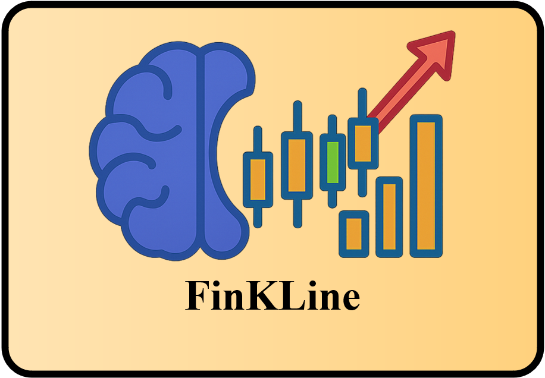

<p align="center">
  
</p>

<h1 align="center">FinKLine 数据集与资源</h1>

<p align="center">
  📈 多模态金融推理 · 🧠 思维链 · 🧩 阶段式后训练 · 🔁 滚动预测评测
</p>
<p align="center">
  <a href="./README.md">English</a> · <a href="#-中文">中文</a>
</p>
## 🌍中文

您也可以访问此链接获取：https://github.com/zhang-jinyi/FinKLine

### ✨ 项目简介

本仓库发布 **FinKLine** 框架相关的数据与训练资源，用于 **多模态金融推理** 与 **多步股票价格预测** 研究。
 内容包含图片文件夹、**三阶段训练数据**（Stage I 至 Stage III）以及 **两套测试集**，其中一套为模拟真实使用的 **滚动预测评测设置**。

### 📦 数据内容

- 🖼️ **训练样例图片（预览）**
  - `images/20250303` 含 **30** 张 K 线图图片，用于快速检查与复现实验流程。
  - **20250303：**https://drive.google.com/drive/folders/1hvIB3hcNnSmiGsFFMdWZrAMSZvQQ6dOT?usp=drive_link
- 🔁 **滚动预测测试图片**
  - `imagestest-0317/20250317` 含 **500** 张图片，用于固定历史窗口的滚动预测评测。
  - **20250317：**https://drive.google.com/drive/folders/1EmrBaq5ba5RY-Sd-9I3pUBcoEbNOmv8J?usp=drive_link
- 🧪 **FinKLine-DB-test 测试图片**
  - `imagestest-0825/20250825` 含 **500** 张图片，对应标准测试集。
  - **20250825：**https://drive.google.com/drive/folders/1dOFwPrwHrxWwv-DNPvzAmsDweXxCzSuD?usp=drive_link
- 🧩 **三阶段训练数据**
  - `Stage I/train_27196_cot.csv`
  - `Stage II/train_4520_png_cot.json`
  - `Stage III/train_4520_regs_cot.json`
- ✅ **测试集**
  - `test/test_500_png_cot.json`
     训练区间构造输入、测试区间作为输出的滚动预测测试集
  - `test/test_500_png_08_cot.json`
     FinKLine-DB-test 的标准测试集

### 🔁 滚动预测评测设置

为评估 **FinKLine-7B** 在实际场景中的能力，我们模拟固定历史窗口的滚动预测设置。
 以 **2025-03-17** 为时间分界，使用训练区间构造输入样本，预测测试区间 **2025-03-18 至 2025-03-21** 的四日收盘价序列。
 该设置用于与代表性多模态大模型基线及分阶段消融版本对比评估，结果对应论文中的 **Table 4**。

### 🗂️ 仓库结构

```
.
├── assets/
│   └── finKLine-icon.png          # README 顶部图标
├── images/
│   └── 20250303/                  # 30 条训练样例图片
├── imagestest-0317/
│   └── 20250317/                  # 500 张滚动预测测试图片
├── imagestest-0825/
│   └── 20250825/                  # 500 张 FinKLine-DB-test 图片
├── Stage I/
│   └── train_27196_cot.csv         # 第一阶段训练数据
├── Stage II/
│   └── train_4520_png_cot.json     # 第二阶段多模态监督微调数据
├── Stage III/
│   └── train_4520_regs_cot.json    # 第三阶段规则约束监督微调数据
└── test/
    ├── test_500_png_cot.json       # 滚动预测测试集
    └── test_500_png_08_cot.json    # FinKLine-DB-test 测试集
```

### 🏷️ 图片命名规则

图片按日期文件夹组织，命名格式如下：

- `000001_20250303.png`
- `000001_20250317.png`
- `000001_20250825.png`

### 📌 引用方式

如在研究中使用本仓库内容，请引用我们的论文。论文接收后可补全卷期页码等信息。

```
@article{FinKLine2025,
  title   = {FinKLine: A Multimodal Chain-of-Thought Training Framework for Stock Price Prediction},
  author  = {Zhang, Jinyi and Wang, Shuo and Jiang, Yueqiu and Luo, Yingfeng and Tian, Ye and Xiao, Tong and Matsumoto, Tadahiro},
  journal = {Knowledge-Based Systems},
  year    = {2025}
}
```


### 📬 联系方式


如需更多材料或有问题咨询，请通过论文中的邮箱联系作者。
